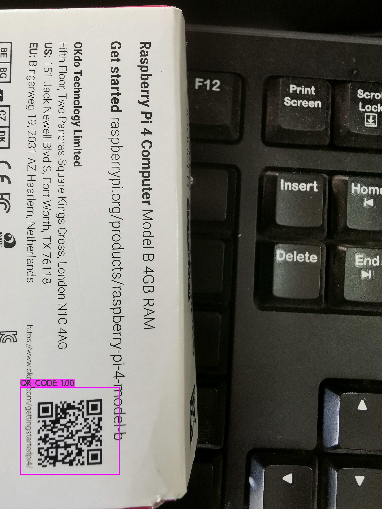
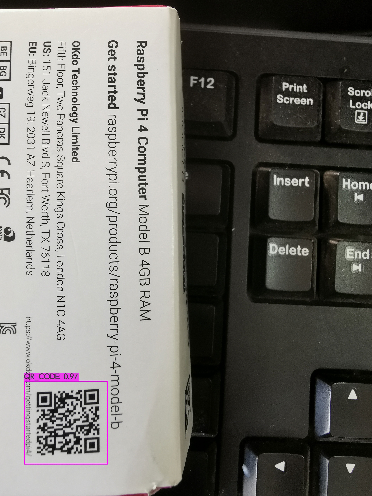

# QR Code Detection with Yolo v3 Model for Windows

The repository aims to do **QR Code detection** with Yolo v3 model and decode **QR Code** in region using [Dynamsoft Barcode Reader](https://www.dynamsoft.com/Products/Dynamic-Barcode-Reader.aspx). 

## Download Pre-trained Yolo3 Model for QR Code
[yolov3-tiny.weights for QR Code](https://www.dynamsoft.com/handle-download?productId=1000003&downloadLink=https://download.dynamsoft.com/codepool/ml/yolo3-tiny-qr.zip)
[yolov3.weights for QR Code](https://www.dynamsoft.com/handle-download?productId=1000003&downloadLink=https://download.dynamsoft.com/codepool/ml/yolo3-qr.zip)

## How to Build and Run Darknet on Windows

Install:

- CMake 3.18.4
- Visual Studio 2019 Community edition
- OpenCV 4.5.0. Add `OpenCV_DIR = C:\opencv\build` to system environment variables.
- CUDA 10.1. Copy `C:\Program Files\NVIDIA GPU Computing Toolkit\CUDA\v10.1\extras\visual_studio_integration\MSBuildExtensions` to `C:\Program Files (x86)\Microsoft Visual Studio\2019\Community\MSBuild\Microsoft\VC\v160\BuildCustomizations`
- cuDNN 7.6.5

Run `build.ps1` in PowerShell to build `darknet.exe`.

Copy `darknet\3rdparty\dbr\bin\DynamsoftBarcodeReaderx64.dll` and `darknet\3rdparty\dbr\bin\vcomp110.dll` to `darknet\`

Extract the model package to the test folder and then run the test:

```
cd test
..\darknet.exe detector test qrcode.data qrcode-yolov3-tiny.cfg qrcode-yolov3-tiny_last.weights 20201105151910.jpg
```

Yolov3


Yolov3-tiny


## About Darknet
https://github.com/AlexeyAB/darknet